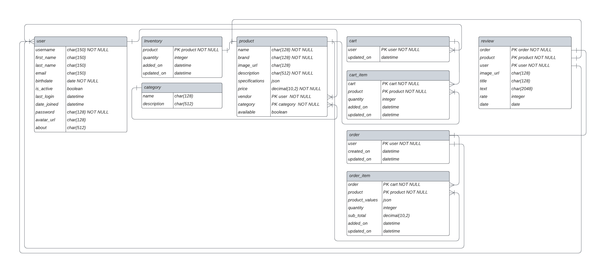

# Description

### A RESTFul API for an e-commerce app.

This project has been developed with Python using Django and Django Rest Framework.
It is powered by a PostgreSQL database.

It has a CI workflow defined with GitHub Actions which sets up and tests the
code committed to this GitHub repo, subsequently, it builds and pushes
a Docker Image to Docker Hub.

This RESTFul API features Jason Web Token authentication and several endpoints with
defined levels of authorization based on the requesting user's role.

The project's endpoints allow performing CRUD operations on the project's database models which are:
 - Accounts
 - Products
 - Inventory
 - Categories
 - Shopping Cart
 - Shopping Cart Items
 - Orders
 - Order Items
 - Reviews

The project is being structured as a three-tiers architecture which consists of:
 - Data Tier: PostgreSQL database
 - Presentation Tier: Netx.JS Application
 - Backend Tier: Django Application (This API)

The presentation tier (front-end) can be found in the
[E-Commerce-Next.js](https://github.com/Eadwulf/e-commerce-nextjs) repo.
<br><br>

# API Documentation

This API has been documented using Postman. The documentation provides extensive information
on how to work with each of the endpoints that the API offers.
Find the documentation in this [link](https://documenter.getpostman.com/view/26698816/2s946fdsnQ).
<br>


# Installation

### Clone The Repository

```console
git clone https://github.com/Eadwulf/e-commerce-API
```

### Change Directory

```console
cd e-commerce-API
```

### Install The Dependencies And Activate The Virtual Environment

```console
pipenv install && pipenv shell
```

<aside>
    💡 Make sure to install <a href="https://pypi.org/project/pipenv/">pipenv</a> on your system
</aside>
<br><br>


# Database Setup

This project requires a PosgreSQL database, but alternatively, you could use a Sqlite3 database.

## Setup With Sqlite3 Database

### Change The Database Configurations In The `config/settings.py`

```python
# config/settings.py

DATABASES = {
    'default': {
        'ENGINE': 'django.db.backends.sqlite3',
        'NAME': BASE_DIR / 'db.sqlite3',
    }
}
```

If you decided to set up the Sqile3 database, skip the next section and jump to
the **Environment Variables** section
<br>


## Setup With PostgreSQL Database

### The Database Settings Are Set As Follows

```python
# config/settings.py

DATABASES = {
  'default': {
    'ENGINE': 'django.db.backends.postgresql',
    'NAME': env('POSTGRES_DB'),
    'HOST': env('POSTGRES_HOST'),
    'PORT': env('POSTGRES_PORT'),
    'USER': env('POSTGRES_USER'),
    'PASSWORD': env('POSTGRES_PASSWORD'),
    },
}
```

<aside>
    💡 If you do not have an existing database and user to use with these settings, follow the
    instructions below and create new ones.
</aside>
<br>

### Enter Into The PostgreSQL Prompt

```sql
psql -U postgres -d postgres
```

### Create The Database

```sql
CREATE DATABASE <database_name>;
```

### Create The User

```sql
CREATE USER <username> WITH ENCRYPTED PASSWORD '<password>';
```

### Modifying User's Parameters

```sql
ALTER ROLE <database_user> SET client_encoding TO 'utf8';
ALTER ROLE <database_user> SET default_transaction_isolation TO 'read committed';
ALTER ROLE <database_user> SET timezone TO 'UTC';
```

### Grant Permissions To The User

```sql
 GRANT ALL PRIVILEGES ON DATABASE <database_name> TO <username>;
```

### Exit The Prompt

```sql
\q
```

# Environment Variables

### Create The Environment Variables File **(.env)**

In the root directory *(e-commerce-API/)*, create the **.env** file and add to it the following

```python
DEBUG=<boolean_value>
SECRET_KEY=<your_django_api_key>
POSTGRES_DB=<your_database_name>
POSTGRES_HOST=<your_database_host>
POSTGRES_PORT=<your_database_port>
POSTGRES_USER=<your_database_user>
POSTGRES_PASSWORD=<your_database_password>
```
<aside>
    💡 Note:
    <ul>
      <li>
        <p>
          <em>django-environ</em> is required to load the environment variables in the `config/settings.py` file.
          Such dependency should be installed by running <em>pipenv install</em>
        </p>
     </li>
     <li>
       <p>
          If you are setting a Sqlite3 database instead of a PostgreSQL, don't include the environment variables for the
          database as they are not required when working with Sqlite3.
       </p>
     </li>
</aside>
<br>

### Generate The SECRET_KEY

To run the project, you will need to set a Django secret key to the `SECRET_KEY` environment variable.
Create one by running

```console
$ python manage.py shell
```

Once in the Django Shell

```python
>>> from django.core.management.utils import get_random_secret_key

>>> get_random_secret_key()
```

It will output a key such as

```python
'30p0cw(#l0z7%2ao7t)%!%h+(v3y+6(#=vbj8x&-snly(#(pu#'
```

<aside>
  💡 Add the key to the corresponding environment variable.
    Don't forget to remove the single quotation marks (') at the beginning and the end of the key
</aside>
<br>


# Migrations

Once the database has been set up as well as the environment variables, you can apply the migrations

```python
python manage.py migrate
```

# Tests

The project includes more than eighty (80) tests that ensure its correct functioning. The tests
cover constraints, business logic, permission, and authorization.

All the endpoints and their allowed HTTP methods are tested.

### Run the tests
```console
python manage.py test
```

Example output

```console
Found 88 test(s).
Creating test database for alias 'default'...
System check identified no issues (0 silenced).
........................................................................................
----------------------------------------------------------------------
Ran 88 tests in 54.432s

OK
Destroying test database for alias 'default'...
```

# Entity Relationship Diagram


